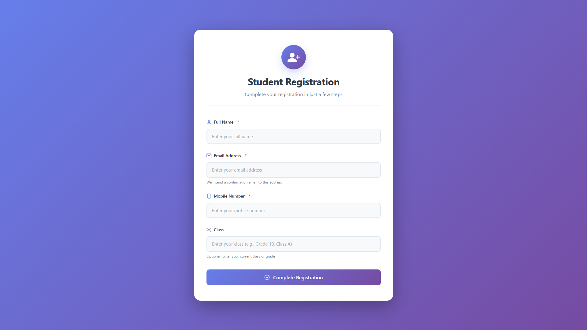
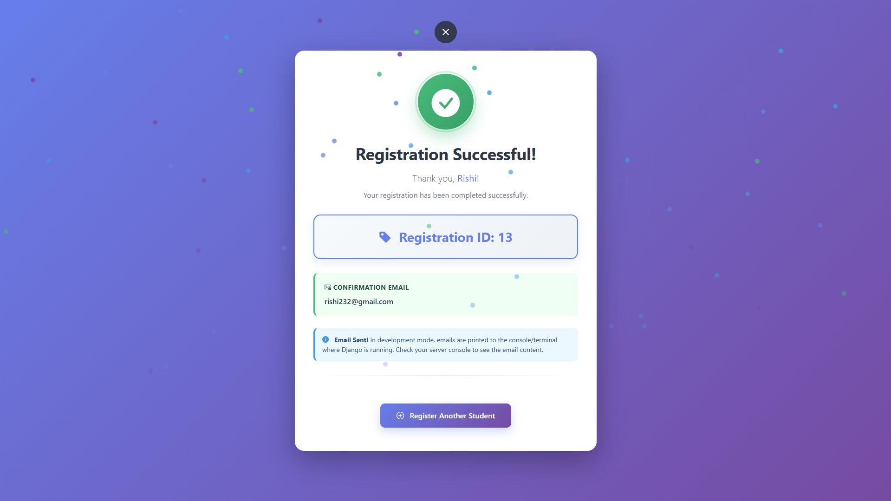

# 🎓 EdTech Student Registration System

<div align="center">


**A secure, professional student registration system with encryption, duplicate prevention, and email confirmation**

</div>

---

## 📸 Screenshots

<div align="center">

### Registration Page


### Success Page


</div>

---

## 🎯 Overview

A comprehensive **Student Registration System** built for EdTech companies. The system provides a secure, user-friendly platform for students to register with encrypted data storage, automatic email confirmations, and robust duplicate prevention mechanisms.

### Key Highlights

- 🔐 **End-to-end encryption** for sensitive data (email & mobile)
- 🎨 **Modern, professional UI** with smooth animations
- ✅ **Hash-based duplicate prevention** system
- 📧 **Automated email confirmations** with registration IDs
- 🧪 **Comprehensive test suite** with 18+ test cases
- 📊 **Django Admin integration** for data management
- 🚀 **Production-ready** codebase with best practices

---

## ✨ Features

### Core Requirements ✅

1. **Student Database Table**
   - MySQL database with `student` table
   - Fields: id, name, email (encrypted), mobile (encrypted), student_class, created, modified
   - Manual table creation via SQL script

2. **Student Registration Page**
   - Modern gradient UI with Bootstrap 5
   - Form validation (name, email, mobile, class)
   - Responsive design for all devices
   - Real-time error messages

3. **Data Encryption**
   - Fernet symmetric encryption for email and mobile
   - Data stored as VARBINARY in MySQL
   - Secure key management

4. **Email Confirmation System**
   - Automatic email sending after registration
   - Professional HTML email template
   - Registration ID included in email
   - SMTP support (Gmail, Outlook, custom)

### Additional Features 🚀

- **Hash-Based Duplicate Prevention** - SHA256 hashing prevents duplicate registrations
- **Professional UI/UX** - Gradient designs, animations, icons, and smooth transitions
- **Django Admin Integration** - View decrypted data, search, and filter capabilities
- **Comprehensive Test Suite** - 18+ test cases covering all functionality
- **Management Commands** - Command-line tools to view student data
- **Enhanced Error Handling** - User-friendly error messages and logging
- **Security Features** - CSRF protection, input validation, secure sessions

---

## 🛠️ Technology Stack

| Component | Technology |
|-----------|-----------|
| **Backend Framework** | Django 5.1 |
| **Database** | MySQL 8.0 |
| **Python Version** | 3.11+ |
| **Encryption** | Fernet (cryptography library) |
| **Frontend** | Bootstrap 5, Bootstrap Icons |
| **Email** | Django Email Backend (SMTP) |
| **Database Adapter** | PyMySQL |

---

## 📦 Installation

### Prerequisites

- Python 3.11 or higher
- MySQL 8.0 or higher
- pip (Python package manager)

### Quick Setup

1. **Clone the Repository**
   ```bash
   git clone https://github.com/Sikorsky3301/AhaGuru-Student-Registration.git
   cd AhaGuru-Student-Registration
   ```

2. **Install Dependencies**
   ```bash
   pip install django PyMySQL cryptography
   ```

3. **Database Setup**
   - Create MySQL database: `edtech_db`
   - Run SQL script: `sql_scripts/student_table.sql`

4. **Configure Settings**
   - Update database credentials in `core/core/settings.py`
   - Configure email settings (optional)

5. **Run Migrations**
   ```bash
   cd core
   python manage.py migrate
   ```

6. **Start Server**
   ```bash
   python manage.py runserver
   ```

Visit: `http://127.0.0.1:8000/`

---

## 🚀 Usage

### Student Registration

1. Navigate to: `http://127.0.0.1:8000/register/`
2. Fill out the registration form
3. Submit and receive confirmation email with Registration ID

### Viewing Data

- **Django Admin**: `http://127.0.0.1:8000/admin/`
- **Command Line**: `python manage.py view_students`
- **MySQL Workbench**: Direct SQL queries

---

## 🔐 Security Features

- **Data Encryption**: Fernet symmetric encryption for email and mobile
- **Duplicate Prevention**: SHA256 hash-based comparison
- **CSRF Protection**: Enabled by default
- **Input Validation**: Server-side and client-side validation
- **Secure Sessions**: Django session management
- **SQL Injection Prevention**: Parameterized queries

---

## 🧪 Testing

Run all tests:
```bash
cd core
python manage.py test students
```

**Test Coverage**: 18+ test cases covering encryption, validation, registration flow, and database operations.

---

## 📚 Documentation

Additional documentation files available:
- `SETUP_INSTRUCTIONS.md` - Complete setup guide
- `EMAIL_SETUP.md` - Email configuration instructions
- `VIEW_DATA.md` - Methods to view student data
- `DUPLICATE_PREVENTION.md` - Duplicate prevention system details

---

## 🤝 Contributing

Contributions are welcome! Please follow these steps:

1. Fork the repository
2. Create a feature branch
3. Commit your changes
4. Push to the branch
5. Open a Pull Request

---

## 📄 License

This project is licensed under the MIT License.

---

## 👨‍💻 Author

**Rishi Raj**

- GitHub: [@Sikorsky3301](https://github.com/Sikorsky3301)
- Project: [AhaGuru Student Registration](https://github.com/Sikorsky3301/AhaGuru-Student-Registration)

---

<div align="center">

**⭐ If you find this project useful, please give it a star! ⭐**

Made with ❤️ for EdTech

</div>
